# Commusoft Platform: Complete Product Specification

**Document Type:** Canonical Product Specification  
**Source:** 90-minute KT Session with Raja (CTO, Commusoft)  
**Date:** February 2026  
**Version:** 2.0 - Standalone Edition

---

## Executive Summary

Commusoft is a field service management (FSM) platform serving the plumbing, heating, electrical, and renewables sectors in the UK market. The platform orchestrates the complete service lifecycle from customer acquisition through job execution to payment collection and recurring revenue optimization.

**Platform Metrics:**
- **Clients:** ~1,400 service companies
- **End Users:** ~10,000 field technicians
- **Average Client Size:** 8-9 technicians (range: 6-400)
- **Market Focus:** UK-based trades (plumbing, heating, electrical, renewables)
- **Deployment:** Cloud SaaS, multi-tenant architecture
- **Pricing:** £55-60 per user per month

**Core Value Proposition:**
Commusoft is NOT a horizontal FSM platform. It's a **domain-specific operating system** for trades businesses, embedding deep industry knowledge about regulatory compliance, certification requirements, parts inventory, and customer service patterns that generic FSM tools cannot replicate.

---

## 1. SYSTEM ARCHITECTURE

### 1.1 Platform Topology

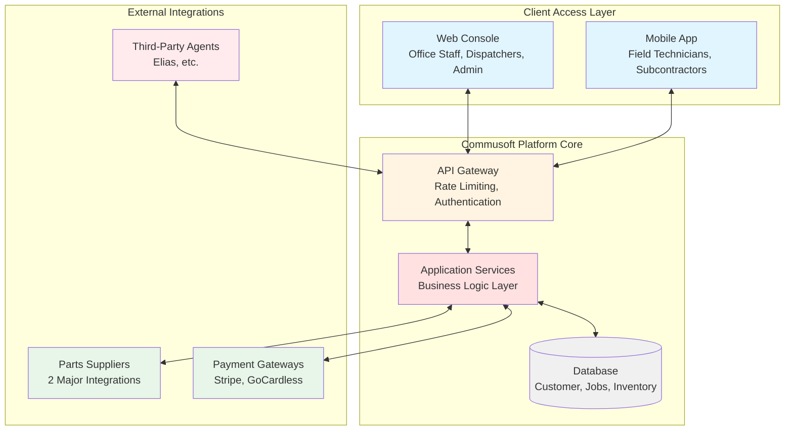

### 1.2 Separation of Concerns

**Web Console (Office-Focused):**
- Customer relationship management (CRM)
- Call handling and intake
- Job scheduling and dispatch
- Invoice generation and payment tracking
- Reporting and analytics
- Administrative configuration

**Mobile Application (Field-Focused):**
- Daily job schedules
- GPS navigation and tracking
- Time tracking (travel vs. labor)
- Parts requests
- Digital certifications
- Photo capture and customer signatures
- Real-time job status updates

**API Layer (Integration-Focused):**
- Third-party agent access (Elias, competitors)
- Supplier integrations (parts ordering)
- Payment gateway connections
- Webhook notifications (job state changes)

**Critical Distinction:**
The platform is architecturally split between **office operations** (planning, coordination) and **field operations** (execution). This reflects the physical reality of the business: office staff cannot perform field work, field staff cannot access full administrative controls.

### 1.3 Data Synchronization Model

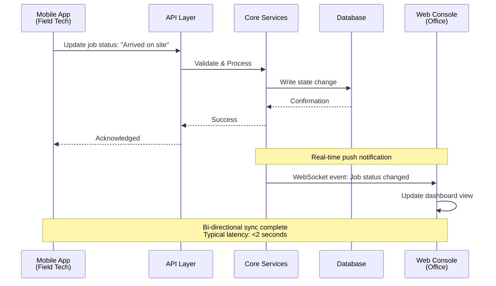

**Sync Characteristics:**
- **Latency:** Sub-2-second updates between mobile and web
- **Offline Support:** Mobile app queues changes when offline, syncs when reconnected
- **Conflict Resolution:** Last-write-wins with timestamps
- **Real-time Events:** WebSocket notifications for job state changes, technician locations

---

## 2. DOMAIN MODEL

### 2.1 Entity Relationship Overview

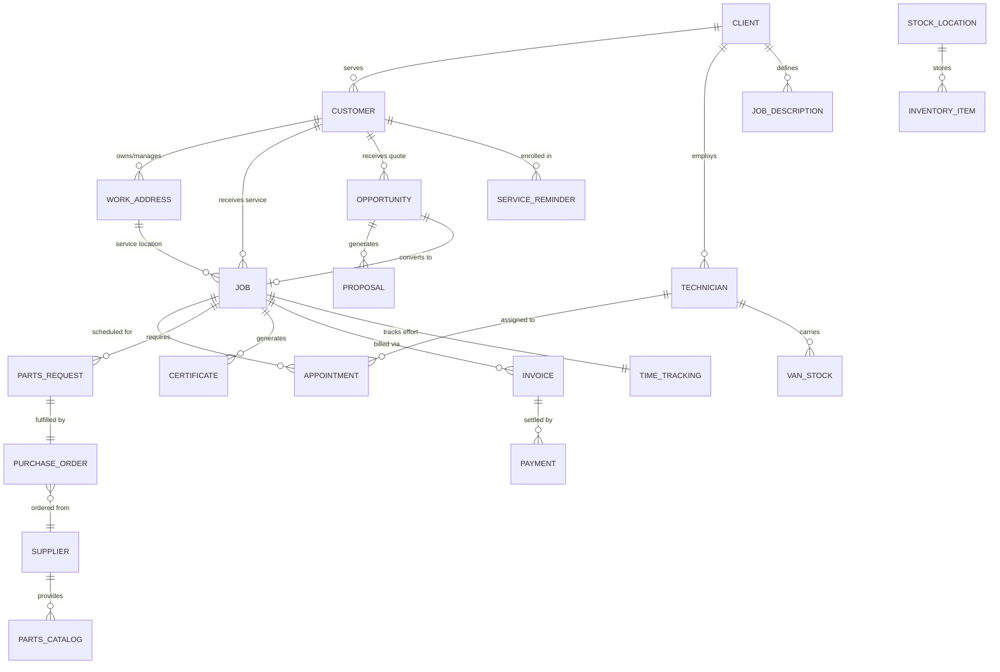

### 2.2 Core Entity Definitions

#### 2.2.1 Client Hierarchy

**CLIENT**
The service company that subscribes to Commusoft (e.g., "GasCare", "London Plumbing Ltd")

```yaml
Client:
  company_name: string
  subscription_tier: "Basic" | "Professional" | "Enterprise"
  users: User[]
  customization:
    job_descriptions: JobDescription[]
    certificate_templates: CertificateTemplate[]
    pricing_rules: PricingRule[]
  billing:
    monthly_fee: decimal
    user_count: integer
    payment_method: PaymentMethod
```

**CUSTOMER vs WORK_ADDRESS**
This is a critical domain distinction that reflects real-world complexity:

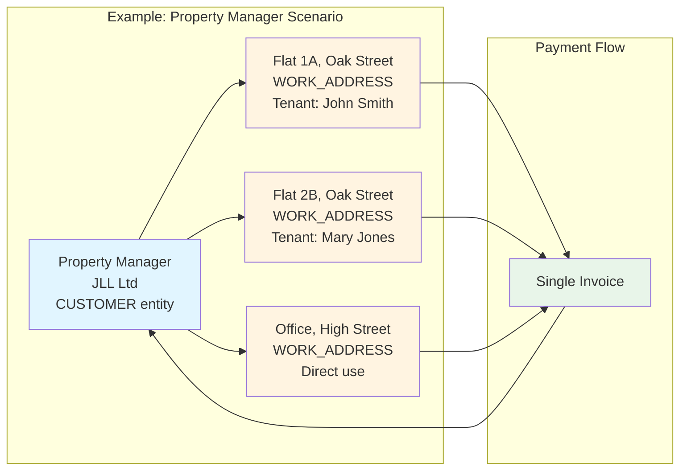

**Key Rules:**
- **CUSTOMER** = Entity that receives invoices and makes payments
- **WORK_ADDRESS** = Physical location where work is performed
- **Ratio:** 1 customer can have 20,000+ work addresses (large property managers)
- **Invoicing:** All work at different addresses can be consolidated into one invoice to the customer

#### 2.2.2 Job vs Opportunity Lifecycle

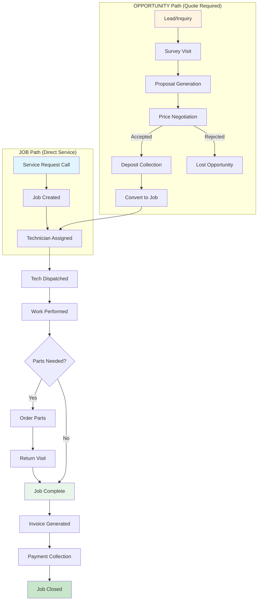

**Decision Criteria: Job vs Opportunity**

| Scenario | Entity Type | Reasoning |
|----------|-------------|-----------|
| Boiler breakdown at 2 AM | **JOB** | Emergency, fixed pricing, immediate dispatch |
| Install new air conditioning | **OPPORTUNITY** | Requires site survey, custom quote, deposit |
| Annual boiler service | **JOB** | Standard service, fixed price, scheduled |
| Replace entire heating system | **OPPORTUNITY** | Complex project, multiple options, high value |
| Fix leaking pipe | **JOB** | Standard repair, known pricing |
| Design and install underfloor heating | **OPPORTUNITY** | Requires design, materials estimation, quote |

#### 2.2.3 Job Entity Deep Dive

```yaml
Job:
  # Core Identifiers
  job_id: integer
  job_number: string (e.g., "CS-2024-00523")
  customer_id: foreign_key
  work_address_id: foreign_key
  
  # Job Classification
  job_description_id: foreign_key  # Links to predefined service type
  priority: "Emergency" | "Urgent" | "Standard" | "Scheduled"
  source: "Phone" | "Web Portal" | "Opportunity Conversion" | "Service Reminder"
  
  # Scheduling
  appointments: Appointment[]
    - scheduled_datetime: timestamp
    - duration_estimate: integer (minutes)
    - technician_id: foreign_key
    - status: "Scheduled" | "Confirmed" | "In Progress" | "Completed" | "Cancelled"
  
  # Skill Requirements
  required_skills: string[]
    - "Gas Safe Certified"
    - "Electrical Part P"
    - "Plumbing NVQ Level 3"
    - "Renewables MCS"
  
  # Parts Management
  parts_requests: PartsRequest[]
    - part_id: foreign_key
    - quantity: integer
    - source: "Van Stock" | "Warehouse" | "Supplier Direct"
    - status: "Requested" | "Reserved" | "Ordered" | "Received" | "Installed"
  
  # Certification & Compliance
  certificates: Certificate[]
    - certificate_template_id: foreign_key
    - completed: boolean
    - signed_by: string (technician name)
    - signed_at: timestamp
    - pdf_url: string
  
  # Time Tracking (Billable vs Non-Billable)
  time_tracking:
    travel_time: integer (minutes) - BILLABLE
    on_site_time: integer (minutes) - BILLABLE
    parts_waiting_time: integer (minutes) - NON-BILLABLE
    break_time: integer (minutes) - NON-BILLABLE
  
  # Financial
  costs:
    labor_cost: decimal
    parts_cost: decimal
    travel_cost: decimal
    other_costs: decimal (parking, tolls, permits)
    total_cost: decimal (calculated)
  
  pricing:
    quoted_price: decimal
    actual_price: decimal (may differ if extra work found)
    discount_applied: decimal
    final_price: decimal
  
  invoices: Invoice[]
    - invoice_id: foreign_key
    - type: "Interim" | "Final"
    - amount: decimal
    - status: "Draft" | "Sent" | "Paid" | "Overdue" | "Cancelled"
  
  # Workflow State
  status: "Created" | "Scheduled" | "In Progress" | "Awaiting Parts" | 
          "Completed" | "Invoiced" | "Paid" | "Closed"
  
  # Audit Trail
  created_at: timestamp
  created_by: user_id
  completed_at: timestamp
  closed_at: timestamp
  
  # Communications Log
  communications: Communication[]
    - type: "Email" | "SMS" | "Phone Call" | "Portal Message"
    - direction: "Inbound" | "Outbound"
    - content: text
    - timestamp: timestamp
```

#### 2.2.4 Service Reminder (Recurring Revenue Engine)

Service Reminders are Commusoft's **automated revenue flywheel**. They convert one-time customers into recurring annual revenue streams.

```mermaid
graph TB
    subgraph "Service Reminder Lifecycle"
        CREATE[Service Reminder Created<br/>Due Date: March 1, 2025]
        
        CREATE --> REMINDER1[First Reminder: Feb 4<br/>25 days before due]
        
        REMINDER1 --> EMAIL1[Send Email]
        EMAIL1 --> WAIT1{Customer<br/>Responds?}
        
        WAIT1 -->|Yes - Booked| CONVERT[Convert to Job]
        WAIT1 -->|No Response| WAIT5[Wait 5 Days]
        
        WAIT5 --> REMINDER2[Second Reminder: Feb 9]
        REMINDER2 --> SMS1[Send SMS]
        SMS1 --> WAIT2{Customer<br/>Responds?}
        
        WAIT2 -->|Yes - Booked| CONVERT
        WAIT2 -->|No Response| WAIT10[Wait 5 More Days]
        
        WAIT10 --> REMINDER3[Third Reminder: Feb 14]
        REMINDER3 --> CALL[Phone Call<br/>AI AGENT TRIGGER]
        CALL --> WAIT3{Customer<br/>Responds?}
        
        WAIT3 -->|Yes - Booked| CONVERT
        WAIT3 -->|No Response| WAIT15[Wait 5 More Days]
        
        WAIT15 --> FINAL[Final Reminder: Feb 19]
        FINAL --> LETTER[Physical Letter]
        LETTER --> WAIT4{Customer<br/>Responds?}
        
        WAIT4 -->|Yes - Booked| CONVERT
        WAIT4 -->|No Response| EXPIRED[Reminder Expired<br/>Schedule Next Year]
        
        CONVERT --> REVENUE[Revenue Generated]
    end
    
    style CREATE fill:#e1f5ff
    style CALL fill:#ffe1e1
    style CONVERT fill:#c8e6c9
    style REVENUE fill:#a5d6a7
```

**Service Reminder Configuration:**

```yaml
ServiceReminder:
  # Core Details
  customer_id: foreign_key
  work_address_id: foreign_key
  service_type: "Boiler Annual Service" | "Gas Safety Certificate" | 
                "Electrical PAT Testing" | "Fire Alarm Inspection"
  
  # Timing
  due_date: date (legal compliance deadline)
  reminder_start_date: date (calculated: due_date - 25 days)
  
  # Multi-Channel Reminder Strategy
  reminder_sequence:
    - day: -25  # 25 days before due
      channels: ["Email"]
      
    - day: -20  # 20 days before due
      channels: ["SMS"]
      
    - day: -15  # 15 days before due
      channels: ["Phone Call", "Email"]  # AI AGENT OPPORTUNITY
      
    - day: -10  # 10 days before due
      channels: ["Physical Letter"]
  
  # Customer Preferences (Override Defaults)
  customer_preferences:
    email_opt_in: boolean
    sms_opt_in: boolean
    phone_call_opt_in: boolean  # AI AGENT GATING
    postal_opt_in: boolean
    preferred_contact_time: "Morning" | "Afternoon" | "Evening"
  
  # Conversion Tracking
  status: "Pending" | "Contact Attempted" | "Booked" | "Declined" | "Expired"
  conversion_date: timestamp
  job_id: foreign_key (if converted to booking)
  decline_reason: string
  
  # Next Cycle
  recurring: boolean (default: true for annual services)
  next_reminder_date: date (calculated: due_date + 365 days)
```

**Legal/Regulatory Context:**
Service Reminders are not just a "nice to have" – they're driven by **legal compliance requirements**:

- **Gas Safety Certificates:** UK law requires landlords to have gas appliances certified annually
- **Electrical PAT Testing:** Required for rental properties and commercial premises
- **Fire Safety Equipment:** Annual inspection legally mandated
- **Consequences of Non-Compliance:** 
  - Fines up to £20,000
  - Insurance invalidation
  - Criminal prosecution in case of accidents

This creates **guaranteed recurring demand** – Commusoft clients can count on these service calls happening every year.

---

## 3. WORKFLOWS & OPERATIONAL PROCESSES

### 3.1 Typical Service Call Flow (Emergency)

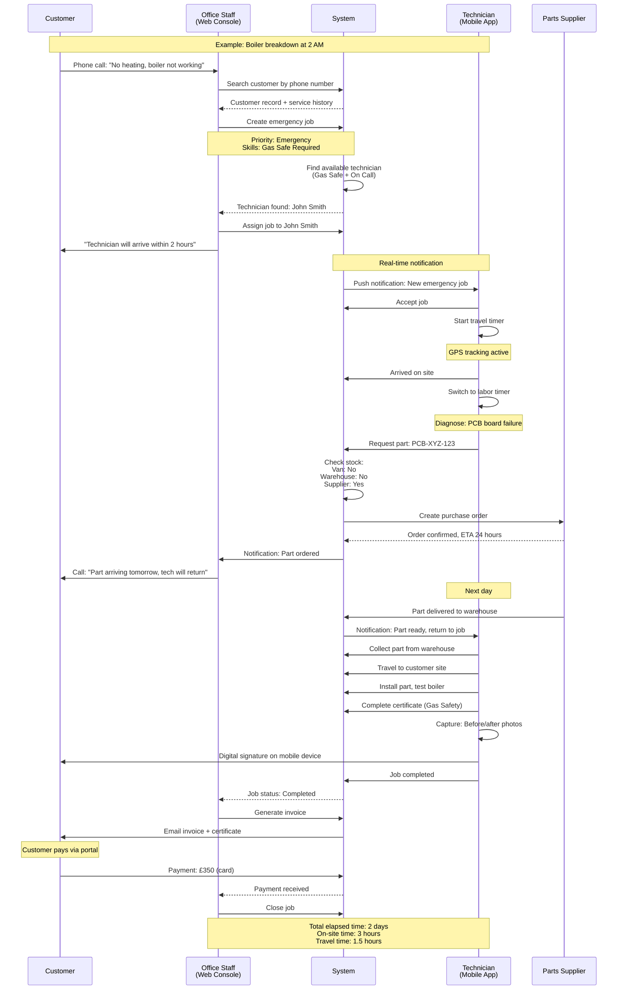

### 3.2 Parts Fulfillment Workflow

One of the most complex operational challenges in field service is **parts logistics**. Commusoft handles this with a multi-tier inventory system:

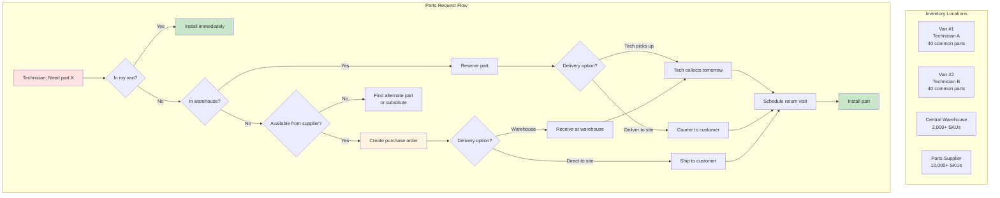

**Stock Reservation Logic (Critical Business Rule):**

```yaml
Part Allocation Priority:
  1. Emergency jobs (overrides all other reservations)
  2. Jobs with customer on-site (tech already dispatched)
  3. Jobs with scheduled appointment in next 24 hours
  4. Jobs with scheduled appointment in next week
  5. Planned maintenance jobs

Stock Reservation Rules:
  - Reserved parts CANNOT be taken by lower priority jobs
  - Exception: Manager override (requires approval in system)
  - Reservation expires after 7 days if job not completed
  - Returned parts (customer cancelled) go back to available stock
```

**Reorder Point Automation:**

```yaml
Auto-Reorder Configuration:
  part_id: SKU-12345
  current_stock: 5 units
  reorder_threshold: 10 units
  reorder_quantity: 20 units
  
  trigger_condition: "stock_level < reorder_threshold"
  action: "Create PO with supplier for reorder_quantity"
  
  supplier_id: preferred_supplier
  delivery_time: 48 hours
  auto_approve: true (if total cost < £500)
```

### 3.3 Technician Daily Workflow (Mobile App)

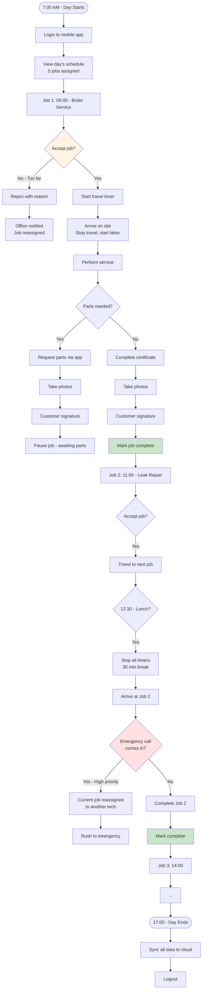

**Technician Performance Tracking:**

```yaml
Daily Metrics (Automatically Captured):
  jobs_completed: 4
  jobs_rejected: 1 (reason: "Outside service area")
  
  time_breakdown:
    total_working_time: 540 minutes (9 hours)
    travel_time: 120 minutes (billable)
    labor_time: 300 minutes (billable)
    break_time: 30 minutes (non-billable)
    admin_time: 90 minutes (completing certificates, etc.)
  
  revenue_generated: £850
  parts_used_value: £200
  
  customer_satisfaction:
    jobs_with_signature: 4/4 (100%)
    jobs_with_photos: 4/4 (100%)
    complaints: 0
```

### 3.4 Invoice & Payment Collection Flow

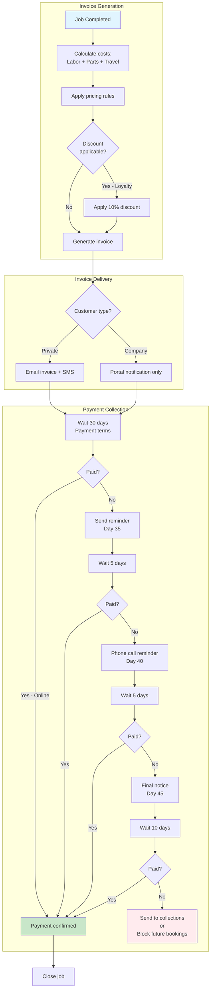

**Payment Methods Supported:**

```yaml
Payment Options:
  1. Online Portal (Customer self-service):
     - Credit/debit card (Stripe integration)
     - Instant confirmation
     - Fee: 1.5% processing fee (absorbed by merchant)
  
  2. Direct Debit (GoCardless integration):
     - Setup mandate (one-time)
     - Automated monthly/annual collections
     - Ideal for service contracts
     - Fee: £0.20 per transaction
  
  3. Bank Transfer:
     - Manual bank details on invoice
     - Customer initiates
     - Office marks as paid when received
     - No processing fee
  
  4. Cash/Cheque (Field payment):
     - Technician collects
     - Must log in mobile app immediately
     - Deposited by office
     - Security risk (discouraged)
  
  5. Invoice (Credit terms):
     - 30-day payment terms (standard)
     - Companies only
     - Credit limit check required
     - Late payment fees: 8% APR statutory
```

---

## 4. INDUSTRY-SPECIFIC CUSTOMIZATIONS

### 4.1 Certification & Compliance Engine

Commusoft's certification system is one of its **deepest competitive moats**. Generic FSM platforms cannot replicate this because it requires industry-specific knowledge of legal requirements.

#### 4.1.1 Certificate Types by Industry

```yaml
Gas Services:
  - Gas Safety Certificate (CP12)
    Required: Annually for rental properties
    Fields: 27 required fields
    Regulator: Gas Safe Register
    Penalty: £20,000 fine + criminal record
    
  - Boiler Benchmark Certificate
    Required: New boiler installations
    Fields: Installation details, warranty activation
    Regulator: Manufacturer requirements
    
  - Landlord Gas Safety Record
    Required: Annually for landlords
    Fields: Appliance list, safety checks performed
    
Electrical Services:
  - Electrical Installation Certificate (EIC)
    Required: New electrical work
    Fields: Circuit details, test results
    Regulator: NICEIC / NAPIT
    
  - Periodic Inspection Report (EICR)
    Required: Every 5 years (rental) / 10 years (owner)
    Fields: 50+ test results
    Penalty: Insurance invalidation
    
  - Portable Appliance Testing (PAT)
    Required: Commercial premises annually
    Fields: Per-appliance test results
    
Plumbing:
  - Water Regulations Certificate
    Required: Certain plumbing installations
    Fields: Backflow prevention, water quality
    
  - Legionella Risk Assessment
    Required: Commercial water systems
    Fields: Temperature readings, tank inspections
```

#### 4.1.2 Certificate Workflow

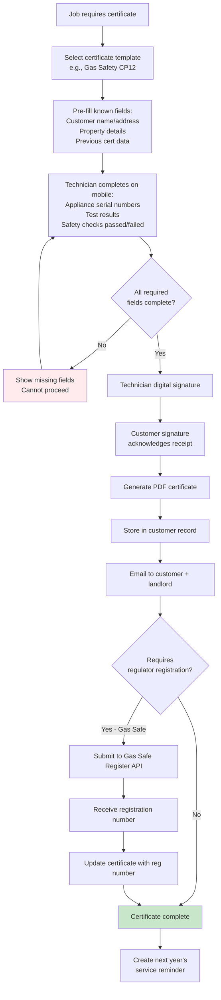

**Example: Gas Safety Certificate Fields**

```yaml
Gas_Safety_Certificate_CP12:
  # Property Information (Auto-filled from job)
  property_address: string
  landlord_name: string
  landlord_address: string
  tenant_name: string (optional)
  
  # Inspection Details
  inspection_date: date
  next_inspection_due: date (calculated: +365 days)
  engineer_name: string (auto-filled from technician)
  engineer_gas_safe_number: string (validated)
  
  # Appliances (Repeating section, 1-10 appliances)
  appliances:
    - appliance_type: "Boiler" | "Cooker" | "Fire" | "Water Heater"
      location: "Kitchen" | "Bathroom" | "Living Room" | Other
      make_model: string
      serial_number: string
      
      # Safety Checks (Boolean: Pass/Fail)
      visual_condition: pass | fail
      flue_safety: pass | fail
      ventilation_adequate: pass | fail
      gas_pressure: decimal (measured in mbar)
      
      # Defects Found
      defects: "None" | "Immediately Dangerous (ID)" | "At Risk (AR)" | "Not to Current Standards (NCS)"
      defect_description: text
      remedial_action_taken: text
  
  # Overall Assessment
  any_defects_found: boolean
  appliances_turned_off: string[] (list of appliances made safe)
  
  # Signatures
  engineer_signature: image (captured on mobile)
  customer_signature: image (captured on mobile)
  
  # Regulator Submission
  gas_safe_registration_number: string (issued after submission)
  submission_date: timestamp
```

**AI Agent Implication:**
This complexity is why Elias (API-only competitor) **cannot** handle certificates effectively:
- Certificate templates are stored in the database but NOT exposed via API
- Field validation rules (e.g., "gas pressure must be 19-25 mbar") are UI-level logic
- Technician must physically measure values with calibrated equipment

An AI agent that can READ certificates (e.g., "What was the gas pressure at last service?") is feasible. An agent that can COMPLETE certificates is not – this requires human technician on-site with equipment.

### 4.2 Skills-Based Technician Matching

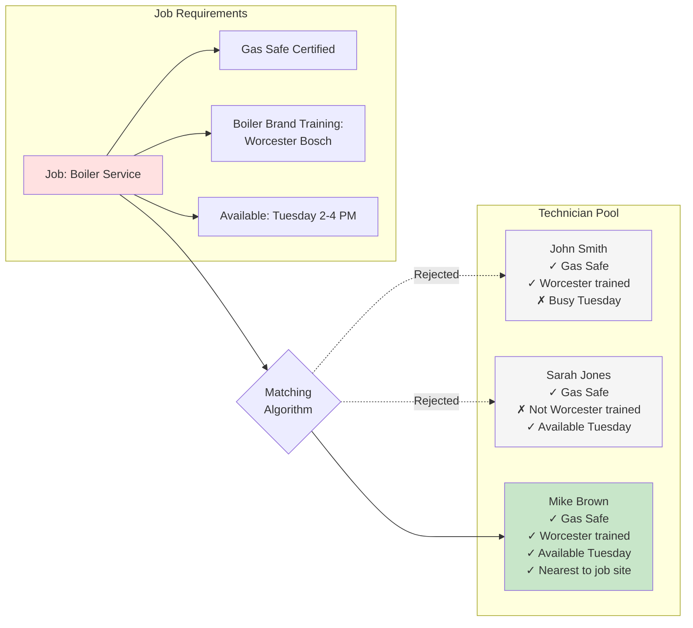

**Technician Skill Matrix:**

```yaml
Technician_Skills:
  certifications:
    - Gas Safe Register Number: "12345678"
      Expiry: 2026-12-31
      Categories: ["CCN1", "CENWAT", "HTR1"]  # Specific gas work types
    
    - Electrical: "NICEIC Approved"
      Expiry: 2025-06-30
    
    - Renewables: "MCS Certified - Heat Pumps"
      Expiry: 2027-03-15
  
  manufacturer_training:
    - "Worcester Bosch Accredited Installer"
    - "Vaillant Advance Installer"
    - "Ideal Boilers Certified"
  
  specializations:
    - "Commercial Heating Systems"
    - "Underfloor Heating"
    - "Smart Heating Controls (Nest, Hive)"
  
  work_preferences:
    willing_to_travel: 30 miles radius
    preferred_job_types: ["Installation", "Service", "Repair"]
    avoid_job_types: ["Emergency callouts after 6 PM"]
  
  performance_metrics:
    customer_satisfaction: 4.8 / 5.0
    jobs_completed_ytd: 347
    average_job_time: 2.3 hours
    first_time_fix_rate: 87%  # Jobs completed in one visit
```

**Matching Algorithm Logic:**

```python
def find_best_technician(job):
    candidates = []
    
    # Filter 1: Required certifications
    for tech in all_technicians:
        if not tech.has_all_certifications(job.required_skills):
            continue  # Skip
        candidates.append(tech)
    
    # Filter 2: Availability
    candidates = [t for t in candidates 
                  if t.is_available(job.scheduled_time)]
    
    # Filter 3: Travel distance
    candidates = [t for t in candidates 
                  if t.distance_to(job.work_address) < t.max_travel_distance]
    
    # Scoring
    for tech in candidates:
        score = 0
        
        # Bonus: Manufacturer training (reduces warranty issues)
        if tech.has_manufacturer_training(job.appliance_brand):
            score += 20
        
        # Bonus: Proximity (reduces travel time)
        distance_miles = tech.distance_to(job.work_address)
        score += (30 - distance_miles)  # Closer = higher score
        
        # Bonus: Customer rating
        score += tech.customer_rating * 5
        
        # Bonus: First-time fix rate
        score += tech.first_time_fix_rate / 10
        
        # Penalty: Overloaded schedule
        if tech.jobs_today >= 6:
            score -= 15
        
        tech.match_score = score
    
    # Return highest scoring technician
    return max(candidates, key=lambda t: t.match_score)
```

---

## 5. INTEGRATION ECOSYSTEM

### 5.1 API Architecture & External Access

```mermaid
graph TB
    subgraph "External Systems"
        ELIAS[Elias AI Agents]
        TITAN[Service Titan<br/>Competitor FSM]
        ACCOUNTING[Accounting Software<br/>Xero, QuickBooks]
        MARKETING[Marketing Tools<br/>Mailchimp, HubSpot]
    end
    
    subgraph "Commusoft API Gateway"
        AUTH[Authentication<br/>OAuth 2.0 + API Keys]
        RATE[Rate Limiter<br/>100 req/min per client]
        LOG[Request Logging<br/>Audit trail]
    end
    
    subgraph "API Endpoints"
        CUSTOMER_API[/customers<br/>GET, POST, PUT]
        JOB_API[/jobs<br/>GET, POST, PUT]
        TECH_API[/technicians<br/>GET availability]
        INVOICE_API[/invoices<br/>GET, POST]
        PARTS_API[/parts<br/>GET inventory]
    end
    
    subgraph "Commusoft Core"
        DB[(Database)]
        BUSINESS[Business Logic]
    end
    
    ELIAS --> AUTH
    TITAN --> AUTH
    ACCOUNTING --> AUTH
    MARKETING --> AUTH
    
    AUTH --> RATE
    RATE --> LOG
    LOG --> CUSTOMER_API
    LOG --> JOB_API
    LOG --> TECH_API
    LOG --> INVOICE_API
    LOG --> PARTS_API
    
    CUSTOMER_API --> BUSINESS
    JOB_API --> BUSINESS
    TECH_API --> BUSINESS
    INVOICE_API --> BUSINESS
    PARTS_API --> BUSINESS
    
    BUSINESS --> DB
    
    style ELIAS fill:#ffebee
    style AUTH fill:#fff4e1
    style DB fill:#e1f5ff
```

**API Capabilities vs Limitations:**

| Operation | API Support | Notes |
|-----------|-------------|-------|
| **Read customer details** | ✅ Full | Name, address, phone, email, payment history |
| **Read customer preferences** | ❌ Limited | Age, communication preferences NOT exposed |
| **Create new customer** | ✅ Full | Requires validation (duplicate check) |
| **Read job details** | ✅ Full | All job fields accessible |
| **Create job** | ✅ Full | Must provide customer_id, job_description_id |
| **Assign technician** | ✅ Full | API checks availability, skills |
| **Read technician availability** | ✅ Full | Returns available slots for date range |
| **Read certificate data** | ❌ No | Certificates not exposed via API |
| **Complete certificate** | ❌ No | Requires mobile app (technician on-site) |
| **Read stock levels** | ✅ Full | All locations (van, warehouse) |
| **Reserve stock** | ⚠️ Partial | Cannot check if reserved for other job |
| **Create invoice** | ✅ Full | Must link to completed job |
| **Charge payment** | ❌ No | Payment processing via separate gateway |

**Key Insight for Competitive Analysis:**
Elias (and other API-only competitors) can build agents for:
- Customer lookup and basic details
- Job creation and scheduling
- Technician availability checking
- Invoice generation

Elias **CANNOT** build agents for:
- Customer persona-based conversations (elderly vs. property manager)
- Certificate handling
- Stock reservation validation
- Domain-specific workflow customization (industry-specific scripts)

This is Commusoft's **defensive moat** – native agents have access to UI-level data and business logic that external agents cannot replicate.

### 5.2 Supplier Integration (Parts Ordering)

```yaml
Supplier_Integration_Model:
  integrated_suppliers:
    - name: "PlumbCenter"
      integration_type: "API"
      capabilities:
        - Real-time pricing
        - Stock availability check
        - Order placement
        - Delivery tracking
      
    - name: "City Plumbing Supplies"
      integration_type: "API"
      capabilities:
        - Catalog sync (10,000+ SKUs)
        - Bulk discount pricing
        - Next-day delivery
        - Invoice reconciliation
  
  ordering_workflow:
    1. Technician requests part via mobile
    2. System checks:
       - Van stock (immediate availability)
       - Warehouse stock (same-day pickup)
       - Supplier stock (next-day delivery)
    
    3. If ordering from supplier:
       - API call: Check price + availability
       - Auto-create PO if < £500
       - Manager approval if > £500
       - Track delivery status
       - Update job when part arrives
    
    4. Part arrives → Notify technician → Schedule return visit
```

### 5.3 Payment Gateway Integration

```yaml
Payment_Processing:
  stripe_integration:
    use_case: "One-time card payments"
    flow:
      - Customer receives invoice via email
      - Email contains link to payment portal
      - Customer enters card details
      - Stripe processes payment
      - Webhook notification to Commusoft
      - Invoice marked as paid
      - Customer receives receipt
    
    fees: 1.4% + £0.20 per transaction
  
  gocardless_integration:
    use_case: "Recurring direct debits (contracts)"
    flow:
      - Customer sets up mandate (one-time)
      - Commusoft schedules recurring collections
      - GoCardless handles bank withdrawal
      - Funds settled in 3-5 business days
      - Failed payments trigger retry logic
    
    fees: £0.20 per transaction (flat rate)
    
    retry_logic:
      - Attempt 1: Immediate
      - Attempt 2: 3 days later
      - Attempt 3: 7 days later
      - If all fail: Suspend service, notify customer
```

---

## 6. DEPLOYMENT & INFRASTRUCTURE

### 6.1 Multi-Tenancy Architecture

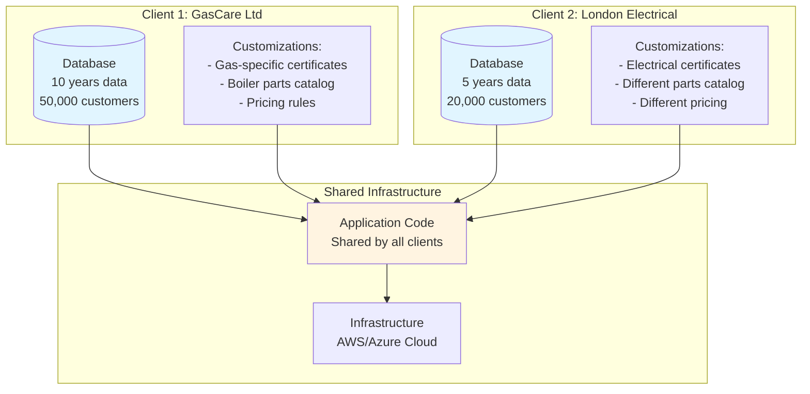

**Tenant Isolation:**
- **Database:** Separate schema per client (data isolation)
- **Customization:** Client-specific configs stored in separate tables
- **Security:** Row-level security ensures Client A cannot access Client B's data
- **Performance:** Shared application tier, isolated data tier

**Scalability Metrics:**
- **Current:** 1,400 clients, ~10,000 concurrent users
- **Architecture Capacity:** Estimated 10,000+ clients (with horizontal scaling)
- **Database Size:** Largest client = 500 GB (10 years of data)

### 6.2 Availability & Performance

```yaml
Service_Level_Objectives:
  uptime: 99.5% (target)
    Downtime allowed: ~3.6 hours/month
    Planned maintenance: Sunday 2-4 AM GMT
  
  response_time:
    web_console_page_load: < 2 seconds (p95)
    api_request: < 500ms (p95)
    mobile_app_sync: < 3 seconds (p95)
  
  data_sync:
    mobile_to_web: < 2 seconds (real-time push)
    web_to_mobile: < 5 seconds (pull-based refresh)

Disaster_Recovery:
  backup_frequency: Every 4 hours
  backup_retention: 30 days
  recovery_time_objective: 4 hours
  recovery_point_objective: 4 hours (max data loss)

Monitoring:
  infrastructure: AWS CloudWatch
  application: New Relic APM
  uptime: Pingdom
  alerts: PagerDuty (24/7 on-call rotation)
```

---

## 7. BUSINESS MODEL & PRICING

### 7.1 Revenue Streams

```yaml
Primary_Revenue_SaaS_Licensing:
  model: Per-user per-month subscription
  pricing: £55-60 per user
  
  typical_client:
    users: 8 (6 field techs + 2 office staff)
    monthly_fee: £480
    annual_contract_value: £5,760
  
  total_arr_estimate:
    clients: 1,400
    average_acv: £5,760
    total_arr: £8,064,000 (~£8M ARR)

Growth_Levers:
  1. New client acquisition (sales team)
  2. User expansion (client grows, adds techs)
  3. Upsell to higher tiers (more features)
  4. Reduce churn (currently ~5% annual)

Secondary_Revenue_Opportunities:
  - Supplier referral fees (parts ordering)
  - Payment processing margin (Stripe/GoCardless)
  - Premium support contracts
  - Custom development projects
  - AI agent subscriptions (NEW - not yet launched)
```

### 7.2 Competitive Landscape

| Competitor | Market | Strengths | Weaknesses |
|------------|--------|-----------|------------|
| **Service Titan** | USA | Deep feature set, well-funded | Expensive, US-focused |
| **Job Logic** | UK | Direct competitor, similar pricing | Less mature product |
| **Simpro** | Australia | Strong in AU/NZ markets | Weak UK presence |
| **Elias** | Multi-platform | AI agents, modern UX | No core FSM, API-dependent |

**Commusoft's Competitive Advantages:**
1. **UK Market Focus:** Deep understanding of UK regulations (Gas Safe, Part P)
2. **Industry Specialization:** Not trying to serve all industries (HVAC only)
3. **10-Year Client Relationships:** Data gravity prevents switching
4. **Supplier Integrations:** Direct API connections to UK parts suppliers
5. **Certification Engine:** Legally compliant certificates (competitors lack this)

**Competitive Threats:**
1. **Elias-style AI Agents:** Cannibalize revenue by sitting on top of Commusoft
2. **Service Titan UK Expansion:** Well-funded competitor entering UK market
3. **Horizontal Platform Consolidation:** If Salesforce/Microsoft enters FSM space

---

## 8. PRODUCT ROADMAP SIGNALS

Based on the KT session, here are the **implicit roadmap priorities** that Raja revealed:

### 8.1 Immediate Priorities (Next 60 Days)

```yaml
Agent_Platform_Launch:
  deadline: April 2026
  goal: "Ship 3 AI agents to block Elias threat"
  
  agents_in_scope:
    1. Service Reminder Agent
       - Automate annual boiler service reminder calls
       - Target: 60% booking conversion rate
       
    2. Lead-to-Speed Agent
       - Call new leads within 15 minutes of inquiry
       - Target: 40% quote conversion rate
       
    3. Out-of-Hours Booking Agent
       - Handle customer calls 6 PM - 9 AM
       - Target: Save 1 FTE call center salary

  success_criteria:
    - 20+ clients enabled at least one agent
    - £500K ARR from agent subscriptions
    - <5% customer complaints about AI calls
    - Zero data privacy incidents
```

### 8.2 Medium-Term (6-12 Months)

```yaml
Platform_Enhancements:
  1. Advanced Scheduling Optimization
     - Route optimization (reduce tech travel time by 20%)
     - Predictive appointment duration (ML-based estimates)
  
  2. Customer Portal Upgrade
     - Self-service booking (reduce call center load)
     - Payment management (view invoices, set up auto-pay)
     - Service history dashboard
  
  3. Mobile App Redesign
     - Offline-first architecture (works without connectivity)
     - Voice-to-text notes (reduce admin time)
     - AR-assisted diagnostics (future: point camera at appliance)
  
  4. Reporting & Analytics
     - Technician performance dashboards
     - Revenue forecasting (based on service reminders)
     - Customer lifetime value analytics
```

### 8.3 Strategic Initiatives (12+ Months)

```yaml
Market_Expansion:
  - International expansion (Ireland, potentially EU)
  - New verticals (appliance repair, locksmith services)
  
Technology_Modernization:
  - GraphQL API (replace REST)
  - Microservices architecture (break monolith)
  - Real-time collaboration (multiple dispatchers on one board)
  
AI_Platform_Maturity:
  - 12+ AI agents covering all workflows
  - Voice-to-job creation (customer calls, auto-creates job)
  - Predictive parts ordering (ML forecasts demand)
```

---

## CONCLUSION: COMMUSOFT'S PRODUCT ARCHITECTURE SUMMARY

### Core Strengths

1. **Domain Depth:** 10+ years of field service workflow knowledge embedded in data models, UI, and business logic
2. **Regulatory Compliance:** Certificate engine ensures legal compliance (competitors cannot easily replicate)
3. **Operational Excellence:** Real-time sync, offline support, multi-channel customer engagement
4. **Client Lock-In:** Data gravity + process embedding = high switching costs

### Strategic Vulnerabilities

1. **API Surface Exposure:** Competitors like Elias can build on top of Commusoft's API
2. **Innovation Speed:** Product team stretched thin, struggling to ship AI features fast enough
3. **Platform Dependence:** If clients adopt third-party agents, Commusoft loses control of customer experience

### Recommended Product Strategy

1. **Native Agent Platform:** Build AI agents INSIDE Commusoft (not as external add-on)
2. **API Restriction:** Limit API access to features that don't commoditize core value
3. **Vertical Integration:** Deepen supplier partnerships, payment processing to capture more value
4. **Data Moat:** Use 10 years of job data to train ML models (parts prediction, scheduling optimization)

---

**Document Metadata:**
- **Version:** 2.0 - Standalone Product Specification
- **Source:** 90-minute KT with Raja (CTO, Commusoft)
- **Date:** February 2026
- **Classification:** Internal Use - STAR Systems Professional Services Team
- **Next Review:** Post-implementation (April 2026)

